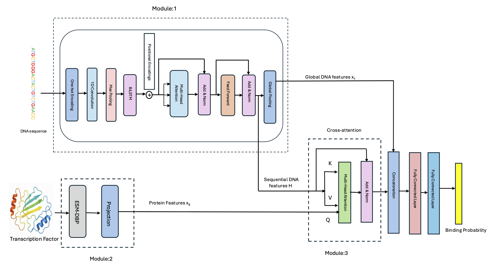

# TransBind

## Table of Contents
- [Overview](#overview)
- [Model Architecture](#model-architecture)
- [Installation](#installation)
  - [Requirements](#requirements)
- [Data Preprocessing Pipeline](#data-preprocessing-pipeline)
  - [Protein Features](#protein-features)
- [Training and Testing](#training-and-testing)
  - [Training Data Preparation](#training-data-preparation)
  - [Training](#training)
  - [Testing](#testing)
  - [Prediction](#prediction)
- [Citation](#citation)

## Overview

TransBind is a deep learning framework for transcription factor (TF) binding prediction that combines DNA sequence information with protein structural features to capture the true diversity of TF–DNA interactions. Unlike prior models that treat all TFs identically, TransBind uses embeddings from ESM-DBP (a protein language model trained on DNA-binding proteins) and a cross-attention mechanism to align each TF’s unique structural properties with genomic sequence features. Trained on 690 ChIP-seq experiments covering 161 TFs across 91 human cell types, TransBind achieves state-of-the-art accuracy (AUROC 0.9504, AUPR 0.3710), recovers known binding motifs for interpretability, and uniquely supports zero-shot prediction for unseen TFs using their amino acid and DNA sequence. This integration of protein-aware modeling with genomic deep learning provides a powerful tool for studying gene regulation, understanding disease-associated variants, and guiding synthetic biology applications.

## Model Architecture


*Figure 1: TransBind model architecture for transcription factor binding site prediction*

## Installation

### Requirements
- PyTorch + PyTorch Lightning
- NumPy, scikit-learn, h5py
- CUDA recommended

### Quick Install
```bash
git clone https://github.com/jianlin-cheng/TFDNABind.git
cd TFDNABind
conda env create -f environment.yml
conda activate transBind
```

## Data Preprocessing Pipeline
This pipeline prepares training data for transcription factor binding site prediction by downloading, preprocessing, labeling, and organizing genomic sequences into a final dataset.

| Step | Script | Description |
|------|--------|-------------|
| 1 | `0_download_data.py` | Download human genome assembly and Transcription Factor Binding Sites |
| 2 | `1_preprocess_narrowPeaks_and_humanGenome.sh` | Preprocess human genome assembly and TF binding sites |
| 3 | `2_compute_overlapping_using_batch.sh` <br> `3_postprocess.sh` <br> `4_merge_peaks_with_same_labels.ipynb` | Find overlapping regions and assign labels |
| 4 | `5_build_bedFile.py` <br> `5.1_convert_metadata.py` | Convert processed data to individual BED files |
| 5 | `6_build_dataset.py` <br> `6.1_extract_labelname.py` | Build final dataset → saves to `data/` directory and extract label names |
| 6 | `7_mapping_between_filename_TF` | Create mapping between features and transcription factors |
| 7 | `8_label_mapping_between_label_and_TF` | Create comprehensive mapping between labels and TFs |

### Protein Features
To extract protein-level embeddings, use ESM-DBP: https://github.com/pengsl-lab/ESM-DBP

## Training and Testing

###  Training Data Preparation

Before training the model, complete the following steps:

| Step | Process              | Description                                                                 |
|------|----------------------|-----------------------------------------------------------------------------|
| 1️   | Data preprocessing   | Complete steps 1–7 from the preprocessing pipeline described above          |
| 2️   | Protein embeddings   | Extract protein-level embeddings using **ESM-DBP**                          |
| 3️  | Dataset organization | Ensure `train.mat` and `valid.mat` are stored in the `data/` directory      |
| 4️  | Feature mapping      | Verify `tf_to_feature_mapping_exact.json` exists (links TF labels to features) |

---

### Training  
Update the following paths in your configuration:
```python
    DATA_FOLDER = "data/"
    MAPPING_FILE = "data/tf_features/tf_to_feature_mapping_exact.json"
    FEATURES_DIR = "data/tf_features/"
```

Run the main training script to train TransBind 

```bash
python train.py
```

Run the train_general.py to train TransBind_general
```bash
python train_general.py [arguments]
```

### Testing
For testing use `test.ipynb`

### Prediction
To run prediction for the new transcription factors(TFs):
1. Format sequences 
    Use 6_build_dataset.py from data preprocessing for sequence formatting. Make sure the length of the input sequence is 1000bp.
2. Generate protein features
    Extract TF embeddings using ESM-DBP
3. Load the mapping file and feature Folder 
    Use the mapping file found in 
        data/tf_features/tf_to_feature_mapping_exact.json 
    Use the feature folder 
        data/tf_features 
  
4. Download and use the checkpoint found in model/model_general.ckpt
5. Update the following path 
    ```python
    TF_FEA_FILE = "data/your_tf.fea" #your TF features
    SEQUENCES_FILE = "data/sequences.mat" #your DNA sequence ```
5. Run prediction
    ```bash
    python predict.py
    ```

## Citation
