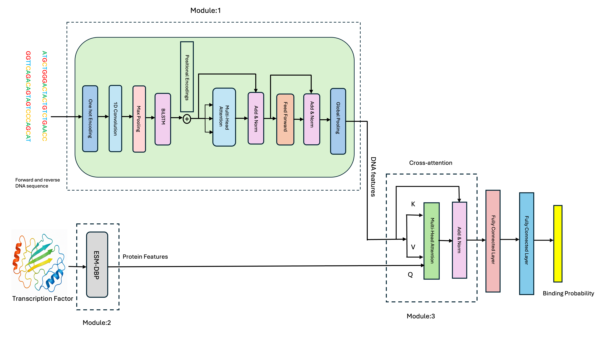

# TransBind

TransBind is a deep learning framework for transcription factor (TF) binding prediction that combines DNA sequence information with protein structural features to capture the true diversity of TF–DNA interactions. Unlike prior models that treat all TFs identically, TransBind uses embeddings from ESM-DBP (a protein language model trained on DNA-binding proteins) and a cross-attention mechanism to align each TF’s unique structural properties with genomic sequence features. Trained on 690 ChIP-seq experiments covering 161 TFs across 91 human cell types, TransBind achieves state-of-the-art accuracy (AUROC 0.9504, AUPR 0.3710), recovers known binding motifs for interpretability, and uniquely supports zero-shot prediction for unseen TFs using their amino acid and DNA sequence. This integration of protein-aware modeling with genomic deep learning provides a powerful tool for studying gene regulation, understanding disease-associated variants, and guiding synthetic biology applications.

## Installation

```bash
git clone https://github.com/jianlin-cheng/TFDNABind.git
cd TFDNABind
conda env create -f environment.yml
conda activate transBind
```

## Model Overview



*Figure 1: TransBind model architecture for transcription factor binding site prediction*

## Data Preprocessing Pipeline

| Step | Script | Description |
|------|--------|-------------|
| 1 | `0_download_data.py` | Download human genome assembly and Transcription Factor Binding Sites |
| 2 | `1_preprocess_narrowPeaks_and_humanGenome.sh` | Preprocess human genome assembly and TF binding sites |
| 3 | `2_compute_overlapping_using_batch.sh` <br> `3_postprocess.sh` <br> `4_merge_peaks_with_same_labels.ipynb` | Find overlapping regions and assign labels |
| 4 | `5_build_bedFile.py` <br> `5.1_convert_metadata.py` | Convert processed data to individual BED files |
| 5 | `6_build_dataset.py` <br> `6.1_extract_labelname.py` | Build final dataset → saves to `data/` directory and extract label names |
| 6 | `7_mapping_between_filename_TF` | Create mapping between features and transcription factors |
| 7 | `8_label_mapping_between_label_and_TF` | Create comprehensive mapping between labels and TFs |

### Protein Features
For protein features, use ESM-DBP: https://github.com/pengsl-lab/ESM-DBP

## Training and Testing

### Training
- **Main model**: Use `train.py`
- **General model**: Use `train_general.py`

Update these paths in the `main()` function:
```python
DATA_FOLDER = "/path/to/your/data/"
MAPPING_FILE = "/path/to/tf_to_feature_mapping_exact.json"
FEATURES_DIR = "/path/to/tf_features/"
```

### Testing
For testing use `test.ipynb`

## Requirements

- PyTorch + PyTorch Lightning
- NumPy, scikit-learn, h5py
- CUDA recommended

## Reference 
