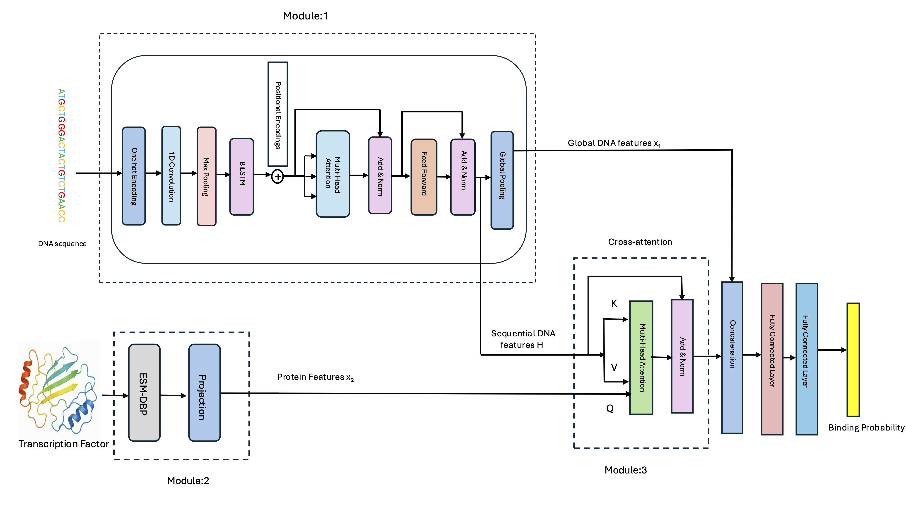

# TransBind

## Table of Contents
- [Overview](#overview)
- [Model Architecture](#model-architecture)
- [Installation](#installation)
  - [Requirements](#requirements)
- [Data Preprocessing Pipeline](#data-preprocessing-pipeline)
  - [Protein Features](#protein-features)
- [Training and Testing](#training-and-testing)
  - [Training Data Preparation](#training-data-preparation)
  - [Training](#training)
  - [Testing](#testing)
  - [Prediction](#prediction)
- [Citation](#citation)

## Overview

TransBind is a deep learning framework for transcription factor (TF) binding prediction that combines DNA sequence information with protein structural features to capture the true diversity of TF–DNA interactions. Unlike prior models that treat all TFs identically, TransBind uses embeddings from ESM-DBP (a protein language model trained on DNA-binding proteins) and a cross-attention mechanism to align each TF’s unique structural properties with genomic sequence features. Trained on 690 ChIP-seq experiments covering 161 TFs across 91 human cell types, TransBind achieves state-of-the-art accuracy (AUROC 0.9504, AUPR 0.3710), recovers known binding motifs for interpretability, and uniquely supports zero-shot prediction for unseen TFs using their amino acid and DNA sequence. This integration of protein-aware modeling with genomic deep learning provides a powerful tool for studying gene regulation, understanding disease-associated variants, and guiding synthetic biology applications.

## Model Architecture


*Figure 1: TransBind model architecture for transcription factor binding site prediction*

## Installation

### Requirements
- PyTorch + PyTorch Lightning
- NumPy, scikit-learn, h5py
- CUDA recommended

### Quick Install
```bash
git clone https://github.com/jianlin-cheng/TFDNABind.git
cd TFDNABind
conda env create -f environment.yml
conda activate transBind
```

## Data Preprocessing Pipeline
This pipeline prepares training data for transcription factor binding site prediction by downloading, preprocessing, labeling, and organizing genomic sequences into a final dataset.

| Step | Script | Description |
|------|--------|-------------|
| 1 | `0_download_data.py` | Download human genome assembly and Transcription Factor Binding Sites |
| 2 | `1_preprocess_narrowPeaks_and_humanGenome.sh` | Preprocess human genome assembly and TF binding sites |
| 3 | `2_compute_overlapping_using_batch.sh` <br> `3_postprocess.sh` <br> `4_merge_peaks_with_same_labels.ipynb` | Find overlapping regions and assign labels |
| 4 | `5_build_bedFile.py` <br> `5.1_convert_metadata.py` | Convert processed data to individual BED files |
| 5 | `6_build_dataset.py` <br> `6.1_extract_labelname.py` | Build final dataset → saves to `data/` directory and extract label names |
| 6 | `7_prediction_sh` |1. Download model files from [Hugging Face](https://huggingface.co/zengwenwu/ESM-DBP/tree/main) 2. Place the `ESM-DBP.model` files in the `ESM-DBP/` directory 3. run ./7_prediction_sh "/ESM-DBP/model" "/path/to/the/fasta/Files/of/TF" "/path/to/output/directory" "cuda:0"
| 7 | `8_mapping_between_filename_TF` | Create mapping between features and transcription factors |
| 8 | `9_label_mapping_between_label_and_TF` | Create comprehensive mapping between labels and TFs |

### Protein Features


## Training and Testing

###  Training Data Preparation

Before training the model, complete the following steps:

| Step | Process              | Description                                                                 |
|------|----------------------|-----------------------------------------------------------------------------|
| 1️   | Data preprocessing   | Complete steps 1–7 from the preprocessing pipeline described above          |
| 2️   | Protein embeddings   | Extract protein-level embeddings using **ESM-DBP**                          |
| 3️  | Dataset organization | Ensure `train.mat` and `valid.mat` are stored in the `data/` directory      |
| 4️  | Feature mapping      | Verify `tf_to_feature_mapping_exact.json` exists (links TF labels to features) |

---

### Training  
Update the following paths in your configuration:
```python
    DATA_FOLDER = "data/"
    MAPPING_FILE = "data/tf_features/tf_to_feature_mapping_exact.json"
    FEATURES_DIR = "data/tf_features/"
```

Run the main training script to train TransBind 

```bash
cd training
python train.py
```

Run the train_general.py to train TransBind_general
```bash
cd training
python train_general.py
```

### Testing
For testing use `test.ipynb` in the training directory

## Prediction
To run prediction for the new transcription factors(TFs):

### 1. DNA One-Hot Encoder

Converts DNA sequences into one-hot encoded format and saves them as `.mat` files.

#### Usage
```bash
cd Predict_new_TF/
python dna_onehot_encoder.py [arguments]

Arguments:
  --sequence        Single DNA sequence to convert
                   (e.g. --sequence "ATGCGATCG")
  --fasta           FASTA file containing sequences
                   (e.g. --fasta sequences.fasta)
  --sequences       Multiple sequences provided directly
                   (e.g. --sequences "ATGC" "CGTA")
  --output          Output filename (required)
                   (e.g. --output results.mat)
  --window_size     Sequence length (default: 1000)
  --no_complement   Don't add reverse complement
  ```

```bash 
python dna_onehot_encoder.py --sequence "ATGCGATCGTAGC" --output my_sequence.mat
```
### 2.TF Embedder

1. Download model files from [Hugging Face](https://huggingface.co/zengwenwu/ESM-DBP/tree/main)
2. Place the `ESM-DBP.model` files in the `ESM-DBP/` directory

```bash
python ESM_DBP.py /path/to/ESM-DBP.model/ input.fasta /output/dir/ device

Arguments:
  /path/to/ESM-DBP.model/   Full path to directory with model files
                           (e.g. /home/user/ESM-DBP/)
  input.fasta               Protein sequence file in FASTA format
                           (e.g. TF.fasta)
  /output/dir/              Output directory for TF features
                           (e.g. /home/user/results/)
```
                
### 3. To predict Transcription Factor binding prediction
``` bash 
cd training
python predict.py  [arguments]

Arguments:
  --tf_fea_file PATH       Path to TF features file (.fea) obtained from step 2
  --sequences_file PATH    Path to DNA sequences file (.mat) obtained from step 1
  --model_path PATH        Model checkpoint path
                          (default: model/model_general.ckpt)
  --mapping_file PATH      TF mapping file
                          (default: data/tf_features/tf_to_feature_mapping_exact.json)
  --features_dir PATH      Features directory
                          (default: data/tf_features)
  --output_prefix NAME     Output filename prefix
```

### Example Workflow

```bash
# Step 1: Process DNA sequences into one-hot encoded format
cd Predict_new_TF
python dna_onehot_encoder.py --sequence 'ATGCGATCG' --output DNA_sequences.mat

# Step 2: Generate protein features using ESM-DBP model
python ESM-DBP/ESM_DBP.py /ESM-DBP/model/ AP-2gamma_Q92754.fasta /example 

# Step 3: Move to training directory
cd ..
cd training

# Step 4: Run TF binding prediction
python predict_newTF.py \
  --tf_fea_file ../example/protein_features.fea \
  --sequences_file DNA_sequences.mat \
  --model_path model/model_general.ckpt \
  --mapping_file data/tf_features/tf_to_feature_mapping_exact.json \
  --features_dir data/tf_features \
  --output_prefix Tf_prediction

# Final results will be saved to results.csv
Example of results.csv 

binding_probability
9.94269285001792e-05 
```

### Output Files
- `DNA_sequences.mat` - One-hot encoded DNA sequences
- `/example/protein_features.fea` - Protein/TF features  
- `results.csv` - Final TF binding predictions

## Citation
